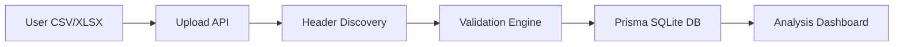
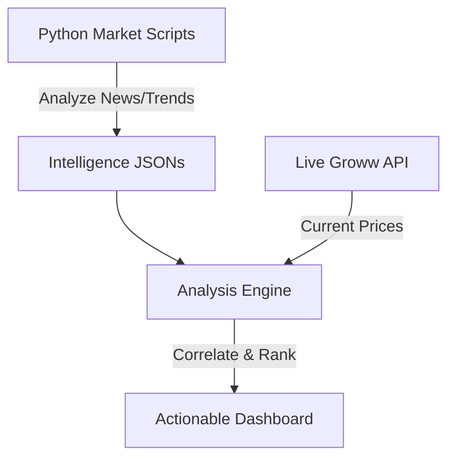

# QuantEdge: System Design Document v1.0

## 1. Architectural Overview
QuantEdge is designed as a **Polyglot Intelligence Framework**. It leverages the high-speed UI capabilities of Next.js and the deep-data processing power of Python, synchronized through a centralized Prisma/SQLite data layer.

### High-Level Layers:
1.  **Presentation Layer**: React-based dashboard with real-time state management and Framer Motion animations.
2.  **Service Layer (Orchestrator)**: Next.js API Routes handling authentication, file processing coordination, and analysis orchestration.
3.  **Intelligence Layer**: Python-driven market trend analysis, news correlation, and fund manager behavior simulation.
4.  **Persistence Layer**: SQLite (via Prisma) for consistent, structured storage of portfolio lineage and market snapshots.

---

## 2. Component Architecture

### A. Autonomous Ingestion Engine
The ingestion engine is designed for high tolerance of varied broker formats.
- **Discovery Logic**: Located in `lib/header-discovery.ts`. It uses a **Keyword-Scoring Algorithm** to scan the first 15 rows of any uploaded file, identifying columns for `identifier`, `quantity`, and `costPrice` with high confidence.
- **Persistence Strategy**: Uses Prisma transactions and `create` loops (optimized for SQLite) to ensure atomicity during bulk ingestion.

### B. Intelligence Hub (Multi-Factor Analysis)
- **Engine**: `lib/analysis-engine.ts`.
- **Logic**: It performs a **Cross-Factor Correlation**. It retrieves the latest "Intelligence Artifacts" (JSON files produced by the Python layer) and maps them to specific holding sectors (Financial, Auto, Defense, IT, etc.).
- **Signal Generation**: Combines news catalysts, government policy shifts, and historical performance (CAGR/Volatility) to generate a high-conviction BUY, HOLD, or SELL signal.

### C. Event Intelligence (Shock Engine)
- **Model**: `RunEventImpact` and `EventImpactRow`.
- **Algorithm**:
    1.  **Sensitivity Mapping**: If an event targets a "Sector," the engine filters holdings by their sector tag.
    2.  **Exposure Calculation**: `Impact = (Holdings Value * Sensitivity coefficient * Magnitude)`.
    3.  **Traceability**: Every computation is stored with a trace JSON to allow "Audit Drill-down" in the UI.

---

## 4. Data Flow

### Portfolio Setup Flow

### Intelligence Sync Flow

---

## 5. Database Schema Details
The system utilizes a relational schema to maintain **Immutable Lineage**:
- **PortfolioUpload**: The source-of-truth file record.
- **Holding**: Individual position snapshots tied to an upload.
- **Run**: A specific execution of analyzer/ruleset against a portfolio. Each "Run" is immutable to allow historical performance tracking.
- **Event**: Dynamic market conditions that can be applied to any "Run."

---

## 6. Python-Node Interop
The system uses an **Artifact-Based Interop** strategy:
1.  Python scripts (in `python/`) run as scheduled or triggered processes.
2.  They output structured JSON results to `python/market_trends/`.
3.  Node.js read-streams these results in `lib/analysis-engine.ts` for immediate correlation.
4.  This decoupled architecture ensures that heavy data science logic doesn't block the UI event loop.

---

## 7. Security & Scalability
- **Security**: Environment variable isolation for API keys. SQL injection prevention via Prisma.
- **Scalability**: The system is vertically scalable. For horizontal scale, the SQLite layer can be migrated to PostgreSQL with a single Prisma provider change.

---
*QuantEdge: Engineering Financial Autonomy.*
